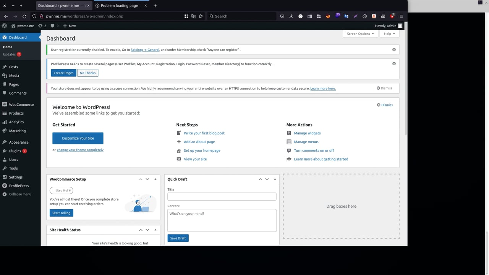

# Description
**CVE-2021-34624**
ProfilePress from 3.0.0 - 3.1.3 allow a user creates the Administrator account.

# Usage:
```bash
Usage:
    python3 CVE-2021-34624.py <domain> <username> <password>

Example:
    python3 CVE-2021-34624.py http://pwnme.me userhaxor passhaxor
```
# POC
[](https://vimeo.com/636025647)